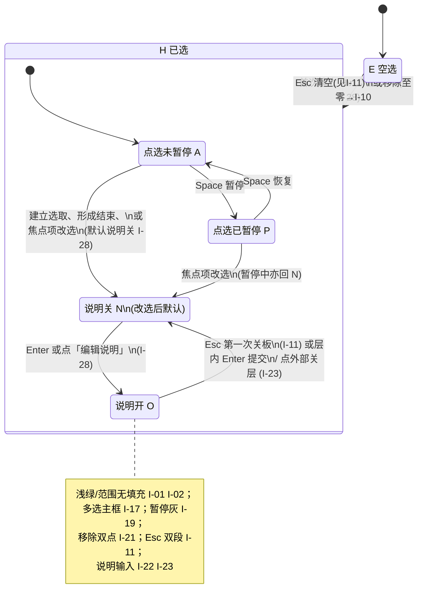

# PRD：选取会话 — 交互、说明与状态机

**里程碑**：里程碑一（选取会话主路径；**复制提示词** 含 **整体/逐项** 说明，**I-14**）。事实口径：`README.md`、`manifest.json`。

**壳体与布局**（贴边条、悬浮已选列表）：[`selection-session-panel-shell-layout.md`](./selection-session-panel-shell-layout.md)。**产品故事入口**：[`user-stories-single-multi-and-layout-move.md`](./user-stories-single-multi-and-layout-move.md)。

---

## 术语与界面命名

**文档用语** 用于 PRD 与研发沟通；**界面用语** 为建议展示文案（可微调字数，语义须一致）；**英文** 供内部对照，默认不向用户展示。

| 文档用语 | 界面用语（建议） | 英文（内部） |
|----------|------------------|--------------|
| **贴边条** | 见壳体 PRD | Edge strip |
| **悬浮已选列表** | **当前选中**（列表） | Floating selected list |
| **操作引导区** | **操作引导**（在 **贴边条** 内，**I-09**） | Operational guidance strip |
| **逐项修改说明** | **修改说明**（单已选项） | Per-element instruction |
| **整体修改说明** | **对当前选取的说明**（整次选取集一段） | Selection-level instruction |
| **说明面板** | 见 **I-13**、**I-18**、**I-22** | Instruction panel |
| **编辑说明**（控件） | **编辑说明**；与 **Enter 开说明**（**I-28**）等价 | Edit instruction |
| **Enter 开说明** | 页上 **Enter** 角标或引导中的 **Enter** | Open instruction via Enter |
| **移除**（控件） | 见 **I-05** | Remove from selection |
| **范围选取**（框选） | 正式 **范围选取**；辅助「拖动画选」 | Marquee / range selection |
| **当前焦点项** | 单选：列表高亮该项。多选：**多选主框**（**I-17**） | Active / union focus |
| **多选主框** | 已选外接轴对齐矩形 | Union selection bounds |
| **复制提示词** | **复制提示词** | Composed prompt for clipboard |
| **点选暂停** | **已暂停选取** / **继续选取**（与 Space 成对） | Selection paused / resumed |

**命名原则**：区块用名词短语；动作用动宾结构；键位用 `kbd`，整句不写英文主导。

### 按页面区域的名称划分与呈现

**1. 壳体**：**贴边条** + 条件出现的 **悬浮已选列表** — 见壳体 PRD **L-01**～**L-06**。

**2. 画布叠加（选取叠加 H）**

与被选页面区域相关。

| 文档用语 | 界面用语（建议） | 呈现（页上） |
|----------|------------------|--------------|
| **范围选取**（框选） | **范围选取** / 「拖动画选」 | **I-01** 仅浅绿闭合描边、无面填充；**I-02** 与点选轮廓同色浅绿系 |
| 点选 | — | **I-02** 元素轮廓浅绿系 |
| **多选主框** | 已选外接轴对齐矩形 | **I-17** 包络；**I-20** 在包络上另设角标 |
| **当前焦点项** | 单选：列表高亮；多选：与多选主框同语境 | 当前说明/交互焦点项的视觉 |
| **Enter 开说明** / **编辑说明** | **Enter** 提示为主（**I-20**） | **I-20** 角标；多选在 **I-17** 包络上 |
| **移除**（控件） | **I-05** | **×**；**I-21** 二次点击 |
| **点选暂停** | **已暂停选取** / **继续选取** | **I-19** 灰描边；恢复后浅绿 |

**3. 说明开（O）：说明面板（画布浮动层）**

正文输入在**画布**上、紧贴当前选取框（单元素或 **I-17** 包络）**正下方**（**I-22**）；**不在**贴边条或悬浮已选列表内。

**4. 系统行为**

| 文档用语 | 界面用语 | 呈现 |
|----------|----------|------|
| **复制提示词** | **复制提示词** | **I-07** 无常驻主按钮；**I-08** 防抖写剪贴板；**I-14** 拼装 |

**自上而下速览**：**贴边条**（壳体 **L-05**）→ **悬浮已选列表**（壳体 **L-02**）→ 画布描边、范围、多选主框、**Enter** 角标（**I-20** / **I-28**）、暂停态 → **说明面板**（**I-22**）。

---

### 已定稿决策（产品拍板，I-xx）

| ID | 事项 | 决议 |
|----|------|------|
| I-01 | 范围选取框视觉 | **仅描边**：闭合矩形 **浅绿系** 描边，**无**面填充。 |
| I-02 | 单点与范围描边 | **统一浅绿系**；线宽/贴边形态可区分。 |
| I-04 | 逐元素文案命名 | 界面与文档 **逐项** 统称 **修改说明**；选取集一层见 **整体修改说明**（**I-13**）。 |
| I-05 | 「移除」呈现（页上若保留） | **×** 常态；悬停 **「点击移除操作」**；无障碍名不依赖 hover。无列表内移除按钮时见 **I-30**。 |
| I-06 | 剪贴板全文命名 | 统一 **复制提示词**。 |
| I-07 | 复制入口 | **无**常驻「复制提示词」主按钮；依赖 **I-08**；引导 **I-15**。 |
| I-08 | 自动复制防抖 | 正文**最后一次**相关变更起 **500 ms** 防抖后写剪贴板一次。 |
| I-09 | 操作引导层级 | **一条主引导** + **若干小号辅助**；辅条数不设上限，以贴边条与 **I-24** 为准。 |
| I-10 | 空选与暂停 | 空选 → **E+A+N**，点选未暂停可立即再选。 |
| I-11 | Esc | **O**：第一次 Esc → **N**。**N+H**：连续退出短时标志内须再 Esc 才清空；否则单次 Esc 清空 → **I-10**。**E** 且无选取时 Esc 无清对象。 |
| I-12 | 多选形成期 | 框选拖移、**Shift+点击** 追加过程中**不**打开 **O**。序列结束：**最后一次**变更起 **500 ms** 无新变化；框选以**松手**为准；**≥2** 项后 **I-13**（仍为 **N**，待 **Enter** 开整体，**I-28**）。 |
| I-13 | 两层说明模型 | 选取建立或变更焦点后默认 **N**（**I-28**）。**≥2** 项：形成期结束且整体闸未放行时 **Enter** → **整体 O**；整体放行后 **I-20** 进入**逐项**。**仅 1 项**：**Enter** → **逐项 O**。 |
| I-14 | 复制提示词构建 | 里程碑一含 **整体+逐项**；线性串接时默认 **整体块在逐项列表前**；可配置归里程碑三。 |
| I-15 | 引导中的复制说明 | **自动写剪贴板**始终 **I-08**。引导里「已自动同步」等句**默认隐藏**，用户**成功手动复制至少一次后**再显示。 |
| I-17 | 多选主框与作用域 | 包络矩形。**整体说明**对多选集**全部**生效；**逐项**仅该项。 |
| I-18 | 说明编辑与控件 | **无**常驻「完成」「清除」「关闭」按钮。见 **I-23**、**I-22**。 |
| I-19 | 点选暂停 | **P**：**灰**描边，不可再点选。**A**：恢复几何与浅绿。 |
| I-20 | 角标与 **Enter** | **逐项**：轮廓约定角。**多选**：**I-17** 包络上另设角标。 |
| I-21 | 移除确认 | **非弹窗**；**短时限内**同一移除控件**第二次点击**才执行。键盘见 **I-30**。 |
| I-22 | 说明输入位置 | 输入框在**画布选取框正下方**浮动层，**不在**贴边条/已选列表内。 |
| I-23 | 说明编辑默认逻辑 | 层内 **Enter** 提交（整体闸未放行时等同完成整体并关闭）；否则关闭层。**Delete/Backspace** 逐字删；**Ctrl+Delete** / **⌘+Delete** / **⌘+Backspace** 清空该层正文（不在输入层提示行展示）。**Enter 提交 · Shift+Enter 换行** 提示在**输入浮动层内**；**贴边条内操作引导**不重复长句。扩展 UI 外 **pointerdown** 关闭说明层等仍适用。 |
| I-24 | 操作引导信息量 | **少露字**：主引导一句为主（**I-09**）；辅句更少更短。 |
| I-28 | 说明层打开 | 已选、**N**、**A**、焦点不在宿主可编辑区且非扩展 UI 内时，**Enter**（无修饰键）：**≥2 且整体闸未放行** → **整体 O**；否则 → **逐项 O**。**P** 下 **Enter** 不打开（先 **Space**）。与「编辑说明」角标等价。 |
| I-30 | 键盘移除/清空 | **说明层关**且焦点不在宿主可编辑区：**Delete/Backspace** 移除**当前焦点项**；**Ctrl+Delete**（macOS 含 **⌘+Delete / ⌘+Backspace**）清空**整次选取**。 |

---

## 1. 目标与范围（摘要）

- **壳体**：见壳体 PRD **L-xx**（贴边条、悬浮已选、无 Tab/无展开）。
- **引导**：**I-09**、**I-15**、**I-24**、**I-07**。
- **说明与 Esc**：**I-12**、**I-13**、**I-17**、**I-18**、**I-23**、**I-28**、**I-11**。
- **页上视觉**：**I-01**、**I-02**、**I-19**、**I-20**、**I-05**、**I-21**。
- **键盘**：**I-30**（与 **I-23** 区分语境）。
- **剪贴板**：**I-06**、**I-08**、**I-14**。

---

## 2. 用户可感知行为

1. **壳体**：贴边条 + 条件悬浮已选列表（壳体 PRD）；引导在条内（**I-24**）。
2. **空选**：**A** 时主引导为点击选择；**P** 时说明 **Space**（**I-09**）。
3. **单选**：建立选取 **H+A+N**（**I-28**）；**Enter** → **逐项 O**（**I-13**）。
4. **多选**：形成期 **N**、不打开 **O**（**I-12**）；完成后 **Enter** → **整体 O**（**I-17**）；放行后逐项。
5. **改选焦点**：默认 **N**；再 **Enter** 或角标 → **O**（**I-28**）。
6. **已选中引导**：**I-09** + **I-15**。
7. **页上描边与角标**：**I-01**/**I-02**/**I-19**；**I-20**；移除 **I-30**（页上控件 **I-05**/**I-21**）。
8. **说明面板**：**I-22**、**I-23**、**I-18**；**Esc** **I-11**。
9. **复制提示词**：**I-08**；层内 **Enter** 再刷新（**I-23**）；**I-15**。
10. **空选回归**：**I-10**。

---

## 3. 内容与素材

教程与沙箱须与 [`tutorial-and-sandbox.md`](./tutorial-and-sandbox.md)、壳体 PRD、本文一致后再改素材。

---

## 4. 验收

- [ ] 壳体符合壳体 PRD **L-01**～**L-06**；说明输入 **I-22**。
- [ ] 空选引导首步中文点击为主；**I-09** / **I-24**。
- [ ] 单选 **I-28** → **逐项 O**（**I-13**）。
- [ ] 多选 **I-12**；**Enter** 整体再逐项（**I-13**）；**I-17**。
- [ ] 改选后 **N** 直至 **I-28**。
- [ ] **I-01**/**I-02**/**I-19**；**I-20**；**I-30**；页上移除 **I-05**/**I-21**。
- [ ] **I-08**；**I-07**；**I-15**；用语 **复制提示词**（**I-06**）。
- [ ] Esc **I-11**；**I-10**。
- [ ] **I-18** / **I-23**；**I-28**；pointerdown 行为 **I-23**。
- [ ] 暂停 **I-19**；Shift **I-12**；**I-14**。

---

## 5. 与路线图

里程碑一，与 `docs/roadmap.md` 主路径一致。

---

## 附录 A：操作引导状态机

操作引导位于 **贴边条** 内（壳体 **L-03**）。**E/H**、**A/P**、**N/O**；层级 **I-09**。

**选取叠加（H）**：**A** → **I-02** 浅绿；**P** → **I-19** 灰。**I-01**/**I-17**；**I-20**；去掉某项 **I-30**（及 **I-21**）。

### 关键转移

| 从 | 事件 | 到 |
|----|------|-----|
| E + A + N | 首次单击唯一元素，或范围松手仅一项 | H + A + N（**I-28**） |
| E + A + N | 范围松手 **≥2** 项 | H + A + N（**I-12**；待 **Enter**） |
| H + A + N | **Enter**（单选或整体已放行后的逐项） | H + A + O（**逐项**） |
| H + A + N | **Enter**（**≥2** 且整体闸未放行） | H + A + O（**整体**） |
| H + P + N | **Enter** | 不打开 **O**（**I-19**） |
| H + * + O | 改选焦点到另一对象 | H + * + N |
| H + * + N | 点「编辑说明」或 **Enter** 角标 | H + * + O（层别依 **I-13**） |
| H + * + * | 去掉一项（**I-30**；页上 **I-21**） | 更新 H；无剩余则 E + A + N（**I-10**） |
| H + * + O | **Esc** | H + * + N（**I-11**） |
| H + * + N | **Esc** | E + A + N（**I-11** → **I-10**） |
| E／H + A + * | **Space** | P / A |

---

## 编号迁移（旧 D-xx → 本文 I-xx）

旧版合并 PRD 中，**同一编号 nn**（01～30，且 **nn ∉ {03, 16, 25, 26, 27}**）的行为条款 **D-nn** 由本文 **I-nn** 承继。**D-03、D-16、D-25、D-26、D-27** 已废止，由壳体 PRD [`selection-session-panel-shell-layout.md`](./selection-session-panel-shell-layout.md) §7 与 **L-xx** 替代。新文档与验收请统一引用 **I-xx** 与 **L-xx**。
