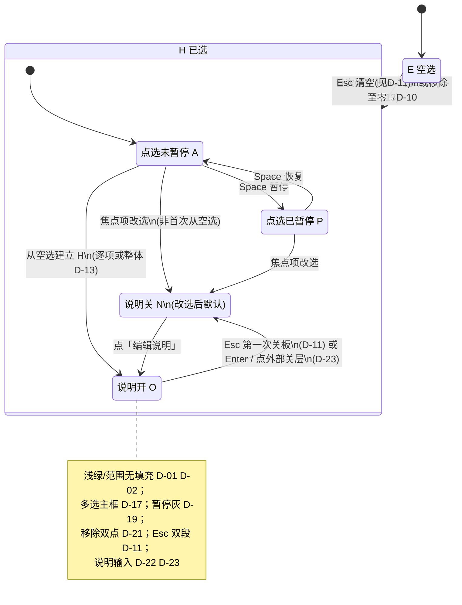

# PRD：选取会话面板 — 信息架构与操作引导

**里程碑**：里程碑一（选取会话主路径；**复制提示词** 含 **整体/逐项** 说明，**D-14**）。事实口径：`README.md`、`manifest.json`。

## 术语与界面命名

**文档用语** 用于 PRD 与研发沟通；**界面用语** 为建议展示文案（可微调字数，语义须一致）；**英文** 供内部对照，默认不向用户展示。

| 文档用语 | 界面用语（建议） | 英文（内部） |
|----------|------------------|--------------|
| **选取会话面板** | 无大标题时可用产品名；需标题时 **选取** 或产品名 | Selection session panel |
| **提示 Tab**（文档） | **提示**（默认） | Prompt / hints tab |
| **选中内容区** | **当前选中** Tab 内列表（与文档「已选内容」同义） | Selected content region |
| **操作引导区** | **操作引导**（主面板 **「提示」** Tab 内，**D-26**） | Operational guidance strip |
| **逐项修改说明** | **修改说明**（单已选项） | Per-element instruction |
| **整体修改说明** | **对当前选取的说明**（整次选取集一段） | Selection-level instruction |
| **说明面板** | 见 **D-13**、**D-18**、**D-22**；副标题/占位与 **整体/逐项** 语境一致 | Instruction panel |
| **编辑说明**（控件） | **编辑说明**（不宜单字「编辑」） | Edit instruction |
| **移除**（控件） | 见 **D-05**；无障碍名 **从选取中移除此项**（或等价） | Remove from selection |
| **范围选取**（框选） | 辅助可用「拖动画选」；正式说明用 **范围选取** | Marquee / range selection |
| **当前焦点项** | 单选：列表高亮该项。多选：**多选主框**（**D-17**） | Active / union focus |
| **多选主框** | 已选各部分外接轴对齐矩形 | Union selection bounds |
| **复制提示词** | **复制提示词**（与 README copy prompt 同义的完整文稿） | Composed prompt for clipboard |
| **点选暂停** | **已暂停选取** / **继续选取**（与 Space 成对） | Selection paused / resumed |

**命名原则**：区块用名词短语；动作用动宾结构；键位用 `kbd`，整句不写英文主导。

### 按页面区域的名称划分与呈现

以下按**在界面上的区域**归纳上表术语；**文档用语** ↔ **界面用语** 与上表一致，呈现口径引用已定稿 **D-xx**。

**1. 整块：选取会话面板**

- **区域**：独立主容器；**D-03** 内部分区，默认**不**左右分栏。
- **呈现**：无大标题时可用产品名；需标题时 **选取** 或产品名。**体量** **D-16**。

**2. 面板主体：Tab（D-26）**

- **「提示」**（默认）：承载 **操作引导**（**D-09**、**D-24**），用户打开面板首屏以键盘与流程说明为主。
- **「当前选中」**：承载已选列表（标签/序号等）；因页上已有选取框与编辑入口，**默认不**切到此 Tab。

**3. 与 D-03 的关系**

- 主面板内**不再**采用「上已选、下引导」固定上下叠放为唯一形态，改为 **Tab 切换**（**D-26**）；体量见 **D-16**、**D-27**。

**4. 画布叠加（选取叠加 H，常叠在页面内容之上）**

与被选页面区域相关；**不一定**落在「已选内容」栏的矩形边框内。

| 文档用语 | 界面用语（建议） | 呈现（页上） |
|----------|------------------|--------------|
| **范围选取**（框选） | 正式 **范围选取**；辅助「拖动画选」 | **D-01** 仅浅绿闭合描边、无面填充；**D-02** 与点选轮廓同色浅绿系，线宽/贴边可区分 |
| 点选（与范围并列） | — | **D-02** 元素轮廓浅绿系 |
| **多选主框** | 已选外接轴对齐矩形 | **D-17** 包络矩形；**D-20** 在包络上**另设**角标，与逐项角标并存不挡关键操作 |
| **当前焦点项** | 单选：列表高亮；多选：与多选主框同语境 | 当前说明/交互焦点项的视觉 |
| **编辑说明**（控件） | **编辑说明** | **D-20** 角标：逐项在各元素轮廓约定角；多选在 **D-17** 包络上 |
| **移除**（控件） | **D-05** | **×**；悬停「点击移除操作」；无障碍名不依赖 hover；**D-21** 短时限内同控件第二次点击才执行 |
| **点选暂停** | **已暂停选取** / **继续选取**（与 Space 成对） | **D-19** 灰描边不可再点选；恢复后浅绿 |

**5. 说明开（O）：说明面板（画布浮动层）**

- **区域**：**说明面板**（**D-13**、**D-18**、**D-22**）：正文输入在**画布**上、紧贴当前选取框（单元素轮廓或 **D-17** 多选主框）**正下方**的浮动层；**不在**选取会话主面板的「已选内容」区内。
- **呈现**：**整体修改说明** → 界面「**对当前选取的说明**」；**逐项修改说明** → 「**修改说明**」。角标 **编辑说明** 进入路径不变。**D-18** / **D-23**：无「完成」「清除」「关闭」控件；键盘与外部点击的默认逻辑见已定稿表。

**6. 系统行为（未必对应单独一块 UI）**

| 文档用语 | 界面用语 | 呈现 |
|----------|----------|------|
| **复制提示词** | **复制提示词** | **D-07** 无常驻主按钮；**D-08** 变更防抖后自动写剪贴板；文稿定义 **D-06**、拼装 **D-14** |

**自上而下、由内到外速览**：**选取会话面板**（**D-27** 极小）→ **提示 / 当前选中** Tab（**D-26**）→ 画布描边、**范围选取**、**多选主框**、角标 **编辑说明**、暂停态 → 选取框**正下方** **说明面板**（**D-22**）。

### 已定稿决策（产品拍板）

| ID | 事项 | 决议 |
|----|------|------|
| D-01 | 范围选取框视觉 | **仅描边**：闭合矩形 **浅绿系** 描边，**无**半透明面填充。 |
| D-02 | 单点与范围描边 | **统一浅绿系**；点选轮廓与范围矩形色相一致，线宽/贴边形态可区分形状。 |
| D-03 | 面板分区 | **Tab**：**「提示」**（默认，内嵌操作引导）与 **「当前选中」**（已选列表）；引导随状态变。不再要求「上已选、下引导」固定上下分栏为唯一形态（见 **D-26**）。 |
| D-04 | 逐元素文案命名 | 界面与文档 **逐项** 统称 **修改说明**；选取集一层见 **整体修改说明**（**D-13**）。 |
| D-05 | 「移除」呈现（页上若保留控件时） | **×** 常态；悬停 **「点击移除操作」**；无障碍名不依赖 hover。主面板内**无**移除按钮时，移除当前项见 **D-30**。 |
| D-06 | 剪贴板全文命名 | 统一 **复制提示词**。 |
| D-07 | 复制入口 | **无**常驻「复制提示词」主按钮；默认依赖 **D-08** 自动写剪贴板。引导文案 **D-15**。 |
| D-08 | 自动复制防抖 | 正文**最后一次**因选中或 **整体/逐项** 说明等变更起 **500 ms** 防抖后写剪贴板一次。 |
| D-09 | 操作引导层级 | **一条主引导** + **若干小号辅助**；辅条数不设上限，以不挤占已选区为准。 |
| D-10 | 空选与暂停 | 空选（Esc 清空、移除至零）→ **E+A+N**，点选未暂停，可立即再选。 |
| D-11 | Esc | **O**：第一次 Esc → **N**（不关选取）。**N+H**：刚从 **O** 因 Esc 关板且处「连续退出」短时标志内须**再** Esc 才清空；否则或未开过 **O** → **单次 Esc** 清空 → **D-10**。**E** 且无选取时 Esc 无清对象。 |
| D-12 | 多选形成期面板 | 框选拖移、**Shift+点击** 追加过程中**不**步步打断 **O**。Shift 链结束：**最后一次**选中变更起 **500 ms** 无新变化；框选以**松手**为准；**≥2** 项后 **D-13**。 |
| D-13 | 两层说明模型 | **≥2** 项多选完成后**先** **整体修改说明**（一次 **O**）；整体结束后再经角标 **编辑说明** 进 **逐项**。**仅 1 项** 不经整体，直接 **逐项 O**。由 1 项增为多项时，**D-12** 结束后同样先整体；此前逐项与整体的合并/清空由实现与导出模板对齐。 |
| D-14 | 复制提示词构建 | 里程碑一含 **整体+逐项** 拼装；须线性串接时默认 **整体块在逐项列表前**；可配置归里程碑三。 |
| D-15 | 引导中的复制说明 | **自动写剪贴板与是否按过 ⌘/Ctrl+C 无关**，始终 **D-08**。仅**操作引导里的句子**（如「已自动同步」「可用 ⌘/Ctrl+C」）**默认隐藏**，在用户**成功手动复制至少一次后**再显示。 |
| D-16 | 面板尺寸 | 相对最初「约 **2×** 高、**1.5×** 宽」基准**持续收窄**；**D-27** 在上一实现版基础上再缩至约 **≤1/2** 量级（宽高以 CSS 表达，可微调）。 |
| D-17 | 多选主框与作用域 | 包络矩形（顶/左/右/底取极值）。**整体说明**对多选集**全部**项同时生效；**逐项**仅该项。 |
| D-18 | 说明编辑与控件 | **无**常驻「完成」「清除」「关闭」按钮。提交、清空与放弃见 **D-23**；输入框锚点见 **D-22**。空选时复制提示词可为空。 |
| D-19 | 点选暂停 | **P**：**灰**描边，页内不可再点选。**A**：恢复暂停前选取与几何，描边回 **浅绿**。 |
| D-20 | 角标位置 | **逐项**：各元素轮廓约定角。**多选/框选**：**D-17** 包络（可与 **D-01** 矩形合一）上**另设**角标；与逐项并存时不挡关键操作。 |
| D-21 | 移除确认（仍适用于页上 **×** 等「移除控件」若保留） | **非弹窗**；**短时限内**对**同一移除控件第二次点击**才执行。主面板路径见 **D-30**（键盘单次移除焦点项）。 |
| D-22 | 说明输入位置 | **修改说明** / **对当前选取的说明** 的正文输入框置于**画布选取框（单元素或 D-17 包络）正下方**浮动层，**不在**主面板「已选内容」内。 |
| D-23 | 说明编辑默认逻辑（不逐条印在输入旁） | **Enter**（不含 Shift）提交：整体闸未放行时等同**完成整体说明**并关闭；其余情况为**关闭说明层**（草稿已随输入实时写入）。**Delete / Backspace** 为系统默认逐字删除。**Ctrl+Delete**；**macOS** 上 **⌘+Delete** 或 **⌘+Backspace** 清空该层正文。在**说明层打开**时，于扩展 UI 外 **pointerdown** 先**关闭说明层**（与页面点选同一下压时**不**改变选取；实现可用「忽略紧随其后的下一次点选」）。上述规则用**操作引导**主/辅句简练概括即可。 |
| D-24 | 操作引导信息量 | **少露字**：主引导仍以一句为主（**D-09**）；辅句**更少、更短**；**D-15** 剪贴板辅句门闩不变。 |
| D-25 | 头部 icon 按钮 | 最小化、关闭为**小尺寸** icon（相对上一版「加大」决策废止），与 **D-27** 极小面板匹配。 |
| D-26 | 主面板 Tab | 两 Tab：**「提示」**（默认，操作引导 + 吐司等）、**「当前选中」**（已选列表，无常驻移除/清空按钮）。 |
| D-27 | 面板体量再收紧 | 在 **D-16** 已缩版本上，主面板宽高再降至约 **≤1/2**（相对再缩前一版），以适配页上已可见选取。 |
| D-30 | 已选列表无按钮时的移除/清空 | **说明层关**且焦点不在宿主页原生可编辑区时：**Delete / Backspace** 移除**当前焦点项**；**Ctrl+Delete**（**macOS** 含 **⌘+Delete / ⌘+Backspace**）清空**整次选取**（与宿主清空选取逻辑一致）。引导中简练提示。 |

---

## 1. 目标与范围（摘要）

- **布局与体量**：**D-03**、**D-16**、**D-26**、**D-27**、**D-22**（Tab：**提示**默认、**当前选中**；面板再缩至约半；说明输入在画布选取框下）。
- **引导**：**D-09**、**D-15**、**D-24**、**D-07**（一主少辅；复制相关引导句默认隐藏；无常驻复制按钮）。
- **说明与 Esc**：**D-12**、**D-13**、**D-17**、**D-18**、**D-23**、**D-11**（多选先整体后逐项；改选焦点默认 **N**，再点 **编辑说明** 开 **O**）。
- **页上视觉与控件**：**D-01**、**D-02**、**D-19**、**D-20**、**D-05**、**D-21**（浅绿/灰暂停；角标；页上移除控件若保留则二次点）。
- **键盘精简选取**：**D-30**（与 **D-23** 说明输入快捷键区分语境）。
- **剪贴板**：**D-06**、**D-08**、**D-14**；每次写入**替换**「粘贴即用」的那一份正文，扩展不堆叠多段主内容（系统剪贴板历史以系统为准）。

## 2. 用户可感知行为

1. **面板**：**D-16** / **D-27** 体量；**D-03** / **D-26** Tab；**D-25** 小 icon；引导随附录 A（**D-24**）。
2. **空选**：**A** 时主引导为点击选择；**P** 时说明如何 **Space** 恢复（**D-09**）。
3. **单选路径**（首次唯一单击或范围仅一项）：直接 **逐项 O**（**D-13**）。
4. **多选路径**（范围 **≥2** 松手，或 Shift 链结束 **≥2**）：形成期不步步 **O**（**D-12**）；完成后**一次** **整体 O**（**D-17** 主框）；整体结束后经角标 **编辑说明** 写**逐项**（仅该项）。全程仅增至一项则同单选。
5. **改选焦点**：说明默认 **N**；用户点 **编辑说明** 再 **O**。
6. **已选中引导**：**D-09** + **D-15**（复制辅助条默认隐藏至成功 **⌘/Ctrl+C** 后）。
7. **页上描边与角标**：浅绿可选取 / 灰暂停（**D-02**、**D-19**）；范围无填充（**D-01**）；角标 **D-20**；去掉选取项 **D-30**（页上控件若保留则 **D-05**/**D-21**）；**编辑说明** → **逐项**（**D-13**）。
8. **说明面板（画布下）**：**D-22**、**D-23**、**D-18**；**Esc** **D-11**。
9. **复制提示词**：变更后 **D-08** 自动写剪贴板；**⌘/Ctrl+C** 同文替换；与 **D-15** 仅影响引导是否展示说明句。
10. **空选回归**：移除最后一项或 Esc 清空后 **D-10**。

## 3. 内容与素材

教程与沙箱若出现本面板分区、框选角标与引导，须与本 PRD 及 `docs/product-requirements-documentation/tutorial-and-sandbox.md` 一致后再改素材。

## 4. 验收

- [ ] 面板 **D-16** / **D-27**、**D-03** / **D-26** Tab（默认「提示」）、**D-22** 输入锚点；引导与附录 A 一致（**D-24**）。
- [ ] 空选引导不出现无关快捷键整表；首步中文点击为主。
- [ ] **D-09** 一主多辅；**D-24** 辅句更少更短；辅弱于主。
- [ ] 单选：无额外点击即 **逐项 O**（**D-13**）。
- [ ] 多选：**D-12** 不步步打断；完成后先 **整体** 再可 **逐项**（**D-13**）；**D-17** 主框与整体作用域。
- [ ] 改选后默认 **N**，直至 **编辑说明**。
- [ ] **D-01**/**D-02**/**D-19** 描边；**D-20** 元素轮廓与 **D-17** 包络上均有角标；**编辑说明** 符合 **D-13**；页上若有移除控件则 **D-05**/**D-21**；**D-30** 键盘移除/清空。
- [ ] 引导中文 + 键帽形式；**D-04** 用语无「元素说明」混用。
- [ ] **D-08** 自动写剪贴板；无可写内容时不写。
- [ ] 粘贴始终对应当前**单份**最新复制提示词；扩展不堆叠多段主内容。
- [ ] **D-07** 无常驻复制按钮；**D-15** 引导句默认隐藏至成功 **⌘/Ctrl+C**；**未按快捷键时仍自动写剪贴板**（同 **D-08**）。
- [ ] 用语 **复制提示词**（**D-06**）。
- [ ] Esc **D-11**；空选 **D-10**。
- [ ] **D-18** / **D-23** 无完成清除关闭按钮；Enter / Ctrl+Delete（及 macOS ⌘ 组合）/ 扩展 UI 外 pointerdown 行为符合 PRD。
- [ ] **D-25** 头部 icon 为小尺寸；**D-26** Tab 行为正确。
- [ ] **暂停/恢复** **D-19**。
- [ ] Shift 追加 **D-12**；**≥2** 后整体 **D-13**。
- [ ] **复制提示词** 含逐项；多选整体阶段含整体；线性时整体在逐项前（**D-14**）。

## 5. 与路线图

归属**里程碑一**，与 `docs/roadmap.md` 主路径一致；**里程碑三**不阻塞里程碑一。里程碑二可对复杂页范围选取做补充回归，不改变本文归属。

---

## 附录 A：操作引导状态机

操作引导默认在 **「提示」** Tab（**D-26**）；与 **D-03** 旧「下面板」表述等价时指该 Tab 区域。**E/H**（空选/已选）、**A/P**（点选未暂停/已暂停）、**N/O**（说明关/开）决定文案与优先级；层级 **D-09**。

**选取叠加（H）**：**A** → **D-02** 浅绿；**P** → **D-19** 灰。范围与包络 **D-01**/**D-17**；角标 **D-20**；从选取中去掉某项见 **D-30**（及页上控件若保留则 **D-21**）。

### 关键转移

| 从 | 事件 | 到 |
|----|------|-----|
| E + A + N | 首次单击唯一元素，或范围松手仅一项 | H + A + O（**逐项**，**D-13**） |
| E + A + N | 范围松手 **≥2** 项 | H + A + O（**整体**，**D-13**） |
| H + * + O | 改选焦点到另一对象 | H + * + N |
| H + * + N | 点「编辑说明」 | H + * + O |
| H + * + * | 从选取去掉一项（**D-30** 键盘；页上控件若保留则 **D-21**） | 更新 H；无剩余则 E + A + N（**D-10**） |
| H + * + O | **Esc** | H + * + N（**D-11**） |
| H + * + N | **Esc** | E + A + N（**D-11** → **D-10**） |
| E／H + A + * | **Space** | 对应 P；再按回 A |

**Shift** 追加至 **≥2** 项且序列结束（**D-12**）→ **整体 O**。**Esc**：**O** 下先关板再 Esc 清空（**D-11**）；**N** 且未连续退出或标志过期 → **单次 Esc** 清空。

