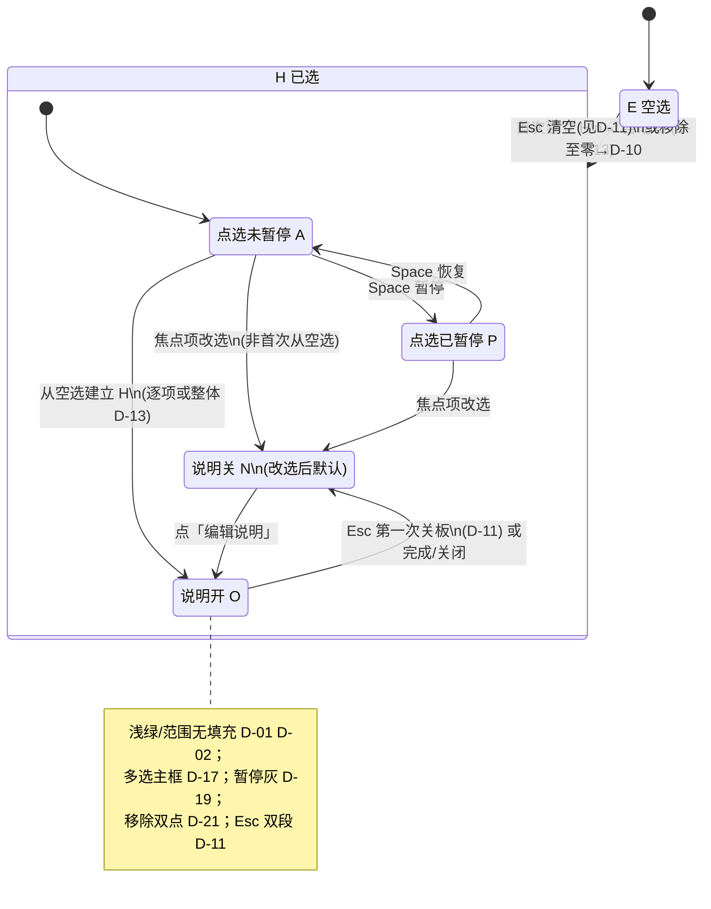

# PRD：选取会话面板 — 信息架构与操作引导

**里程碑**：里程碑一（选取会话主路径；**复制提示词** 含 **整体/逐项** 说明，**D-14**）。事实口径：`README.md`、`manifest.json`。

## 术语与界面命名

**文档用语** 用于 PRD 与研发沟通；**界面用语** 为建议展示文案（可微调字数，语义须一致）；**英文** 供内部对照，默认不向用户展示。

| 文档用语 | 界面用语（建议） | 英文（内部） |
|----------|------------------|--------------|
| **选取会话面板** | 无大标题时可用产品名；需标题时 **选取** 或产品名 | Selection session panel |
| **选中内容区** | **已选内容** | Selected content region |
| **操作引导区** | **操作引导** | Operational guidance strip |
| **逐项修改说明** | **修改说明**（单已选项） | Per-element instruction |
| **整体修改说明** | **对当前选取的说明**（整次选取集一段） | Selection-level instruction |
| **说明面板** | 见 **D-13**、**D-18**；副标题/占位与 **整体/逐项** 语境一致 | Instruction panel |
| **编辑说明**（控件） | **编辑说明**（不宜单字「编辑」） | Edit instruction |
| **移除**（控件） | 见 **D-05**；无障碍名 **从选取中移除此项**（或等价） | Remove from selection |
| **范围选取**（框选） | 辅助可用「拖动画选」；正式说明用 **范围选取** | Marquee / range selection |
| **当前焦点项** | 单选：列表高亮该项。多选：**多选主框**（**D-17**） | Active / union focus |
| **多选主框** | 已选各部分外接轴对齐矩形 | Union selection bounds |
| **复制提示词** | **复制提示词**（与 README copy prompt 同义的完整文稿） | Composed prompt for clipboard |
| **点选暂停** | **已暂停选取** / **继续选取**（与 Space 成对） | Selection paused / resumed |

**命名原则**：区块用名词短语；动作用动宾结构；键位用 `kbd`，整句不写英文主导。

### 已定稿决策（产品拍板）

| ID | 事项 | 决议 |
|----|------|------|
| D-01 | 范围选取框视觉 | **仅描边**：闭合矩形 **浅绿系** 描边，**无**半透明面填充。 |
| D-02 | 单点与范围描边 | **统一浅绿系**；点选轮廓与范围矩形色相一致，线宽/贴边形态可区分形状。 |
| D-03 | 面板分区 | **上** 已选内容，**下** 操作引导；引导随状态变，默认**不**左右分栏。 |
| D-04 | 逐元素文案命名 | 界面与文档 **逐项** 统称 **修改说明**；选取集一层见 **整体修改说明**（**D-13**）。 |
| D-05 | 「移除」呈现 | **×** 常态；悬停 **「点击移除操作」**；无障碍名不依赖 hover。**执行移除** **D-21**。 |
| D-06 | 剪贴板全文命名 | 统一 **复制提示词**。 |
| D-07 | 复制入口 | **无**常驻「复制提示词」主按钮；默认依赖 **D-08** 自动写剪贴板。引导文案 **D-15**。 |
| D-08 | 自动复制防抖 | 正文**最后一次**因选中或 **整体/逐项** 说明等变更起 **500 ms** 防抖后写剪贴板一次。 |
| D-09 | 操作引导层级 | **一条主引导** + **若干小号辅助**；辅条数不设上限，以不挤占已选区为准。 |
| D-10 | 空选与暂停 | 空选（Esc 清空、移除至零）→ **E+A+N**，点选未暂停，可立即再选。 |
| D-11 | Esc | **O**：第一次 Esc → **N**（不关选取）。**N+H**：刚从 **O** 因 Esc 关板且处「连续退出」短时标志内须**再** Esc 才清空；否则或未开过 **O** → **单次 Esc** 清空 → **D-10**。**E** 且无选取时 Esc 无清对象。 |
| D-12 | 多选形成期面板 | 框选拖移、**Shift+点击** 追加过程中**不**步步打断 **O**。Shift 链结束：**最后一次**选中变更起 **500 ms** 无新变化；框选以**松手**为准；**≥2** 项后 **D-13**。 |
| D-13 | 两层说明模型 | **≥2** 项多选完成后**先** **整体修改说明**（一次 **O**）；整体结束后再经角标 **编辑说明** 进 **逐项**。**仅 1 项** 不经整体，直接 **逐项 O**。由 1 项增为多项时，**D-12** 结束后同样先整体；此前逐项与整体的合并/清空由实现与导出模板对齐。 |
| D-14 | 复制提示词构建 | 里程碑一含 **整体+逐项** 拼装；须线性串接时默认 **整体块在逐项列表前**；可配置归里程碑三。 |
| D-15 | 引导中的复制说明 | **自动写剪贴板与是否按过 ⌘/Ctrl+C 无关**，始终 **D-08**。仅**操作引导里的句子**（如「已自动同步」「可用 ⌘/Ctrl+C」）**默认隐藏**，在用户**成功手动复制至少一次后**再显示。 |
| D-16 | 面板尺寸 | 相对改版前：**高度约 2×**、**宽度约 1.5×**；可后续微调。 |
| D-17 | 多选主框与作用域 | 包络矩形（顶/左/右/底取极值）。**整体说明**对多选集**全部**项同时生效；**逐项**仅该项。 |
| D-18 | 完成 / 清除 | **完成**：本条说明定型。**清除**：清空正文，**不关**输入框。空选时复制提示词可为空。 |
| D-19 | 点选暂停 | **P**：**灰**描边，页内不可再点选。**A**：恢复暂停前选取与几何，描边回 **浅绿**。 |
| D-20 | 角标位置 | **逐项**：各元素轮廓约定角。**多选/框选**：**D-17** 包络（可与 **D-01** 矩形合一）上**另设**角标；与逐项并存时不挡关键操作。 |
| D-21 | 移除确认 | **非弹窗**；**短时限内**对**同一移除控件第二次点击**才执行；第一次仅「待确认」（微动效/hover 由设计定）。 |

---

## 1. 目标与范围（摘要）

- **布局与体量**：**D-03**、**D-16**（上已选、下引导；约 2× 高、1.5× 宽）。
- **引导**：**D-09**、**D-15**、**D-07**（一主多辅；复制相关引导句默认隐藏；无常驻复制按钮）。
- **说明与 Esc**：**D-12**、**D-13**、**D-17**、**D-18**、**D-11**（多选先整体后逐项；改选焦点默认 **N**，再点 **编辑说明** 开 **O**）。
- **页上视觉与控件**：**D-01**、**D-02**、**D-19**、**D-20**、**D-05**、**D-21**（浅绿/灰暂停；角标；移除二次点）。
- **剪贴板**：**D-06**、**D-08**、**D-14**；每次写入**替换**「粘贴即用」的那一份正文，扩展不堆叠多段主内容（系统剪贴板历史以系统为准）。

## 2. 用户可感知行为

1. **面板**：**D-16** 体量；**D-03** 分区；引导随附录 A 状态变化。
2. **空选**：**A** 时主引导为点击选择；**P** 时说明如何 **Space** 恢复（**D-09**）。
3. **单选路径**（首次唯一单击或范围仅一项）：直接 **逐项 O**（**D-13**）。
4. **多选路径**（范围 **≥2** 松手，或 Shift 链结束 **≥2**）：形成期不步步 **O**（**D-12**）；完成后**一次** **整体 O**（**D-17** 主框）；整体结束后经角标 **编辑说明** 写**逐项**（仅该项）。全程仅增至一项则同单选。
5. **改选焦点**：说明默认 **N**；用户点 **编辑说明** 再 **O**。
6. **已选中引导**：**D-09** + **D-15**（复制辅助条默认隐藏至成功 **⌘/Ctrl+C** 后）。
7. **页上描边与角标**：浅绿可选取 / 灰暂停（**D-02**、**D-19**）；范围无填充（**D-01**）；角标 **D-20**；移除 **D-05** + **D-21**；**编辑说明** → **逐项**（**D-13**）。
8. **说明面板内**：**完成/清除** **D-18**；**Esc** **D-11**。
9. **复制提示词**：变更后 **D-08** 自动写剪贴板；**⌘/Ctrl+C** 同文替换；与 **D-15** 仅影响引导是否展示说明句。
10. **空选回归**：移除最后一项或 Esc 清空后 **D-10**。

## 3. 内容与素材

教程与沙箱若出现本面板分区、框选角标与引导，须与本 PRD 及 `docs/product-requirements-documentation/tutorial-and-sandbox.md` 一致后再改素材。

## 4. 验收

- [ ] 面板 **D-16**、分区 **D-03**；引导与附录 A 一致。
- [ ] 空选引导不出现无关快捷键整表；首步中文点击为主。
- [ ] **D-09** 一主多辅；辅弱于主。
- [ ] 单选：无额外点击即 **逐项 O**（**D-13**）。
- [ ] 多选：**D-12** 不步步打断；完成后先 **整体** 再可 **逐项**（**D-13**）；**D-17** 主框与整体作用域。
- [ ] 改选后默认 **N**，直至 **编辑说明**。
- [ ] **D-01**/**D-02**/**D-19** 描边；**D-20** 元素轮廓与 **D-17** 包络上均有角标；**移除**/**编辑说明** 符合 **D-05**/**D-21** 与 **D-13**（编辑说明打开逐项）。
- [ ] 引导中文 + 键帽形式；**D-04** 用语无「元素说明」混用。
- [ ] **D-08** 自动写剪贴板；无可写内容时不写。
- [ ] 粘贴始终对应当前**单份**最新复制提示词；扩展不堆叠多段主内容。
- [ ] **D-07** 无常驻复制按钮；**D-15** 引导句默认隐藏至成功 **⌘/Ctrl+C**；**未按快捷键时仍自动写剪贴板**（同 **D-08**）。
- [ ] 用语 **复制提示词**（**D-06**）。
- [ ] Esc **D-11**；空选 **D-10**。
- [ ] **完成/清除** **D-18**。
- [ ] **暂停/恢复** **D-19**。
- [ ] Shift 追加 **D-12**；**≥2** 后整体 **D-13**。
- [ ] **复制提示词** 含逐项；多选整体阶段含整体；线性时整体在逐项前（**D-14**）。

## 5. 与路线图

归属**里程碑一**，与 `docs/roadmap.md` 主路径一致；**里程碑三**不阻塞里程碑一。里程碑二可对复杂页范围选取做补充回归，不改变本文归属。

---

## 附录 A：操作引导状态机

操作引导在面板**下部**（**D-03**）。**E/H**（空选/已选）、**A/P**（点选未暂停/已暂停）、**N/O**（说明关/开）决定文案与优先级；层级 **D-09**。

**选取叠加（H）**：**A** → **D-02** 浅绿；**P** → **D-19** 灰。范围与包络 **D-01**/**D-17**；角标 **D-20**、移除 **D-21**。

### 关键转移

| 从 | 事件 | 到 |
|----|------|-----|
| E + A + N | 首次单击唯一元素，或范围松手仅一项 | H + A + O（**逐项**，**D-13**） |
| E + A + N | 范围松手 **≥2** 项 | H + A + O（**整体**，**D-13**） |
| H + * + O | 改选焦点到另一对象 | H + * + N |
| H + * + N | 点「编辑说明」 | H + * + O |
| H + * + * | 移除（**D-21** 第二次点击生效） | 更新 H；无剩余则 E + A + N（**D-10**） |
| H + * + O | **Esc** | H + * + N（**D-11**） |
| H + * + N | **Esc** | E + A + N（**D-11** → **D-10**） |
| E／H + A + * | **Space** | 对应 P；再按回 A |

**Shift** 追加至 **≥2** 项且序列结束（**D-12**）→ **整体 O**。**Esc**：**O** 下先关板再 Esc 清空（**D-11**）；**N** 且未连续退出或标志过期 → **单次 Esc** 清空。

